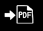

# Village Newbies varausjärjestelmä
__oti-projekti__

Savonia AMK:n Ohjelmistotuotanto I -kurssin ohjelmistoprojekti.

## Käyttöohje

### Ohjelman avaaminen testausta varten

1. Lataa zip-pakkaus tietokoneelle ja pura se
2. Avaa koodinkäsittelyohjelma, joka tukee Javaa (suos. IntelliJ).
3. Valitse puretun zip-pakkauksen kansio ja avaa se uutena projektina (IntelliJ:ssä).
4. Avaa MySQL WorkBench ja sieltä toimiva palvelin.
5. Suorita SQL-tiedostot 'vn.sql' ja 'insertit testi.sql' (ks. Tiedostorakenne).
6. Päivitä palvelimen tietokannat ja varmista, että tiedostot suoritettiin onnistuneesti.
7. Avaa IntelliJ:ssä projektin luokka 'Main' ja suorita se vihreästä nuolipainikkeesta tai valitse Run > Run 'Main'.

### Ohjelman käyttö

*Käyttöliittymän ulkoasu*

__Näkymät:__
  - Alueet
  - Mökit
  - Palvelut
  - Varaukset
  - Asiakkaat
  - Laskut

Ruudun vasemmassa laidassa olevia painikkeita käyttämällä voi siirtyä näkymästä toiseen.

Jokaisessa näkymässä voi selata ja hallita sen otsikkoon liittyviä tietoja. 
(Esim. näkymässä 'Alueet' voi hallita tietokantaan tallennettujen alueiden tietoja.

__Tietojen haku:__

Jokaisen näkymän ylälaidassa on hakupaneeli, jossa voi säätää alempaan paneeliin tulostuvien tietojen suodatusta.
- Kirjoittamalla hakukenttään hakusanan ja painamalla painiketta 'Suorita haku' näytettävät tulokset päivittyvät niin, 
että vain hakusanan sisältävät hakukohteet näytetään.
- Valitsemalla 'Lajittelu'-pudotusvalikosta haluamasi lajittelukriteerin ja painamalla painiketta 'Suorita haku' voit 
lajitella näytettävät tulokset esim. aakkosjärjestykseen tai ID:n mukaan.
- Muita hakupaneelin suodattimia ovat esim. alueen valinta pudotusvalikosta ja aikavälin valinta kalenterivalintatyökalulla.

__Muut toiminnot:__

*Tietojen lisäys*

*Tietojen poisto*

*Tietojen muokkaus*

*Tietojen tarkastelu ikkunassa*

*Laskun vienti tiedostoksi*

## Tiedostorakenne

### Koodi

- __Main__
  - Ohjelman aloitus
- __Alue__
- __Asiakas__
- __Lasku__
- __Mokki__
- __Palvelu__
- __Tietokanta__
- __Varaus__
- __LaskuStatus__
- __PoistoIkkuna__
- __Posti__
- __Nappula__
- __ToggleNappula__
- __Utils__

### Resurssit

- __tietokanta__
  - Tietokannan luontiskripti ('vn.sql')
  - Insert-skripti testausta varten ('insertit testi.sql')
- __kuvakkeet__
  - Tietojen lisäykseen, muokkaamiseen, poistamiseen, tarkasteluun ja tiedostoksi viemiseen liittyvät kuvakkeet
  - Logo

  

